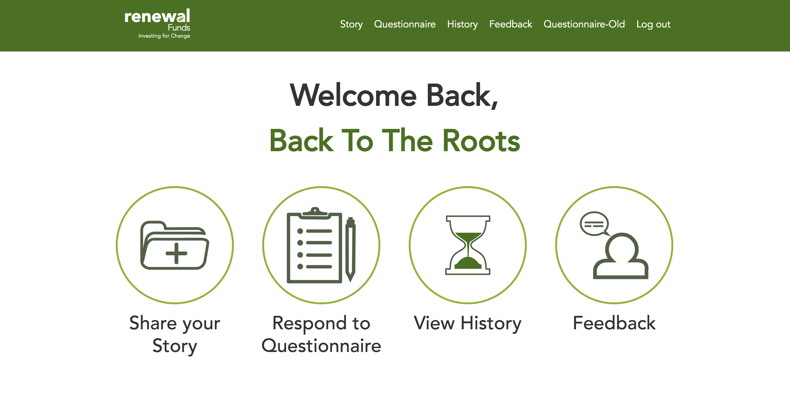

# Renewal Funds Community Project - WordPress, PHP, CSS/SASS JQuery

### Development by Justin Levett-Yeats, Cheol Kim and Martin Zhangyx

This project was intended to provide a replacement business system for the process of capturing impact statements from portfolio 
companies for the investment firm Renewal Funds.

The business process called for the creation of a number of portfolio companies for a particular financial year and for those portfolio companies
to login to the application and provide impact statements.  These impact statements consist of a collection of stories, answered questionnaires and images.

The application consists of a Wordpress back-end, used by Renewal Funds employees, and a web front-end, used by the portfolio companies, with 
designs and business processes proved by UX/UI at Red Academy.

## Technologies Used

- WordPress
- PHP
- HTML5
- CSS3/SASS
- JQuery

## Personal Learnings

JLY - The development of this project allowed me to explore some of the functionality aspects of WordPress, especially in regards to query design and the PHP programming.
This project also enabled me to investigate the intricacies of programming plugins and manipulating their functionality to the project requirements.  Additionally I gained 
very useful experience in project and team management as this project continued.

CK - This was the first project I got to work in a team. Through this project I learned how to divide up the workflow of the project and the process of git pull/push while fixing merge conflicts. 
Also I managed to refine my WordPress terminology knowledge and learned how to use complex WordPress plugins to meet client's needs for the website.

MZ - From this project, I have a deep understanding of WordPress, PHP, JavaScript / jQuery, and got good practice of front-end development skills. For instance, the header is the case of using 
multiple skills. The dynamic header is the results showing the connection between back end and front end. Hamburger menu presents dynamic dropdown menu fitting different viewport size by JavaScript / jQuery. 
And the use of wordpress plugins and CSS make the header functional and beautiful. Along working on this wordpress project, I did plenty of research on PHP, jQuery and wordpress, which enhanced my skills a lot.

##References
http://www.wordpress.org/

## Setup / Installation

##### Install
`> npm i`

##### Run
`> gulp`